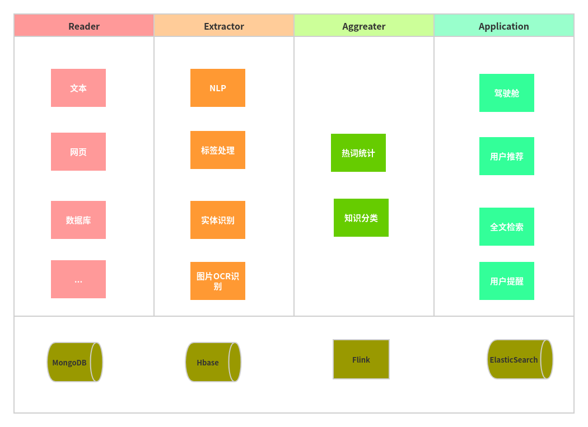

## 服务划分

### 数据读取器 Reader

负责数据从源的读取，原样落库

### 数据抽取器 Extractor

对源数据抽取，负责数结构化字段的处理。

### 数据聚合器 Aggreator

对结构化数据进行分析

### 数据网关 Gateway

将数据作为服务提供给外部调用

### server Application

统一打包

-----------------------------------
目前这个好像意义不是很大，先暂停
